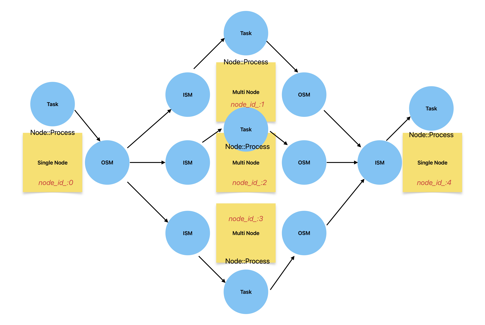

# BMF多节点数据拆分与聚合方案


## 总体思想
由于BMF框架目前每一个Node只支持包含一个`ISM(InputStreamManager)`和`OSM(OutputStreamManager)`用来管理每一个Node的数据IO操作。

因此，想实现BMF框架的Node之间数据传输的拆分与聚合就要从`ISM`和`OSM`分别下手。

图中示例模拟了`Single -> Multi -> Single`的模型

## 数据拆分

如图，在本demo中，有一个单节点要传数据给下游三个节点，而数据传输是由`OSM`管理的，因此，我们需要在`OSM`中实现数据拆分操作。

在框架中，`OSM`中的`OS`可绑定多个`ISM`，这些`ISM`存储在`std::vector<MirrorStream> mirror_streams_`中。

既然是动态数组，那么就可以实现遍历操作，每次遍历送出一个`packet(bmf_sdk::Packet)`即可

```cpp
int OutputStreamManager::post_process(Task &task) {
    for (auto &t : task.outputs_queue_) {
        auto q = std::make_shared<SafeQueue<Packet>>(t.second);
        output_streams_[t.first]->propagate_packets(q);
    }
    return 0;
}

int OutputStream::propagate_packets(
    std::shared_ptr<SafeQueue<Packet>> packets) {
    for (auto &s : mirror_streams_) {
        auto copy_queue = std::make_shared<SafeQueue<Packet>>(*packets.get());
        copy_queue->set_identifier(identifier_);
        s.input_stream_manager_->add_packets(s.stream_id_, copy_queue);
    }
    return 0;
}
```

在原先的实现中，是直接把packet队列送入下游节点，也就意味着三个下游节点将收到完全一样的内容。

为了提升效率，我们需要进行数据拆分，每次遍历`mirror_streams_`时送出一个`packet(bmf_sdk::Packet)`

> 需要注意的是，原先实现中的`packets`是`std::shared_ptr<SafeQueue<Packet>>`，这里面会含有多个pkt，特别是在最后10-20帧的处理，所有的pkt会一起从队列里传过来。

### 三种解决方案：

1. 我们需要将packets里的pkt取出，一个一个组装成`std::make_shared<SafeQueue<Packet>>`送给下游节点，可能还需要添加一个缓冲队列来避免特殊情况pkt的丢失。

2. 第一种方案，频繁的pop，push，分配内存操作会有较大的性能损失，可以修改`InputStreamManager::add_packets`接口，使其可以直接接收`(bmf_sdk::Packet)`而不是队列，这样就可以减少push、分配队列内存的消耗

3. 根据观察，只有最后20个左右的pkt会组装在一个`task`传到`OSM`，其他的所以大量的从队列pop、push到新队列是浪费资源的。如果可以的话，在框架层面可以取消队列模式，直接传输`(bmf_sdk::Packet)`

## 数据聚合

同样的，多个`OS`可以绑定同一个`ISM`,都可以正常发送pkt，但问题在于，想要下游节点得到正确的数据，这些pkt的顺序就必须和拆分之前的一样。

回顾拆分的过程，我们是通过遍历的方式依次给pkt，如图，顺序依次是`node_id_:1,2,3`。那么`node4`的`ISM`就需要依次添加`node1,2,3`传来的pkt。

但在框架中，`OS`有下游节点`ISM`的镜像，但下游节点`ISM`中并不能查看上游节点的具体信息。但要实现数据聚合就必须知道pkt是由哪个节点而来才能进行排序

### 两种解决方案：
1.  `input_stream_manager_->add_packets(s.stream_id_, copy_queue, node_id_)`添加一个传输node id的参数接口，为了防止pkt丢失，还需要一个临时的缓冲区来存储三个OS来的pkts，并标记好node id，ISM中有一个添加上游节点的方法`input_stream_manager_->add_upstream_nodes(node_id)`，在这里可以初始化缓冲区，如下
> 值得一提的是，OS并没有node_id_属性，可以加一个，在graph调用`OutputStream::add_upstream_nodes(int node_id)`的时候顺便初始化。
```cpp
...
std::map<int, std::shared_ptr<SafeQueue<Packet>>> tem_queue_;
...
int InputStreamManager::add_upstream_nodes(int node_id) {
    upstream_nodes_.insert(node_id);

    std::shared_ptr<SafeQueue<Packet>> tmp_queue =
        std::make_shared<SafeQueue<Packet>>();
    tem_queue_.insert(
        std::pair<int, std::shared_ptr<SafeQueue<Packet>>>(
            node_id, tmp_queue));

    return 0;
}
```
然后在add_packets先缓冲数据，再遍历这个缓冲区tem_queue_，按照tem_queue_[0],tem_queue_[1],tem_queue_[2]的顺序，期间如果某一个队列为空则结束函数，等待下一次填充直到满足要求。


2. 大改ISM层，打通上下游节点的通信，实现IS可以绑定多个OSM（目前只有OS绑定ISM，只能上游对下游单向通信），多个上游节点OSM向单个下游节点IS传输pkts，IS可以根据绑定OSM的顺序来选择pkt

## 一些想法

如果不想改变大体框架的话，根据pkt队列只有最后18-22帧才会组装成一个队列`std::shared_ptr<SafeQueue<Packet>>`，前面的pkts队列里都只有一个pkt，那么我们在OS中遍历`mirror_streams_`时可以每一次直接送出一个pkts队列，这样就节省了额外的pop、push操作，与原先实现的代码算法复杂度也一致。具体代码如下：
```cpp
class OutputStream{
    ...
    size_t stream_index_ = 0;
    ...
}
int OutputStream::propagate_packets(
    std::shared_ptr<SafeQueue<Packet>> packets) {
    while(!packets->empty()){
        auto copy_queue = std::make_shared<SafeQueue<Packet>>(*packets.get());
        copy_queue->set_identifier(identifier_);
        s.input_stream_manager_->add_packets(s.stream_id_, copy_queue);
        stream_index_ = (stream_index_ + 1) % mirror_streams_.size();
    }

    return 0;
}
```

在ISM中仍然要对pkts队列进行筛选顺序，根据接口`input_stream_manager_->add_packets(s.stream_id_, copy_queue, node_id_)`传进来的node id来进行缓存，并按照顺序遍历缓冲区进行下一步操作，每一次遍历如果对应的pkts`std::map<int, std::shared_ptr<SafeQueue<Packet>>> tem_queue_;`中有数据，就全部取出加入`IS`的缓冲中。

`伪代码`（语法可能有误 只是展示思路）如下：
```cpp
class InputsStreamManager {
    ...
    size_t queue_index_ = 0;
    ...
}
void InputStreamManager::add_packets(
    int stream_id, std::shared_ptr<SafeQueue<Packet>> packets
    int upstream_node_id) {
    ...
    if (input_streams_.count(stream_id) > 0) {
        auto it = tem_queue_.find(upstream_node_id);
        // alloc memory for packets
        it->second = std::make_shared<SafeQueue<Packet>>(*packets.get());
        while(!tem_queue_[queue_index_]->empty()) {
            auto queue = tem_queue_[queue_index_];
            // if the queue is right index
            input_streams_[stream_id]->add_packets(queue.second);
            queue_index_ = (queue_index_ + 1) % tem_queue_.size();
        }

        ...
    }
}
```


> 相较于原先实现也只是增加了缓冲和遍历的操作，但这是聚合所必须的步骤。

## 勘误补充

### 数据拆分
在原有的架构实现中，运行这样一个1->3->1的graph，node 1会将同样的数据发送给多个下流节点，但目前的框架对于多个上流节点输入数据并没有做相关的特别实现。

在某些graph中 是有多条流水线存在 比如enhance_demo中decoder的输出分别输出给enhance和composition，所以这个特性（将相同的数据给不同的下流节点）是有必要保留的

那么我的数据拆分方案就应该区别于这种情况，避免冲突，我的设想是，在builder.cpp层面做好接口，只需要在应用层多一个传入参数设置多开节点数
```cpp
Node Graph::Module(const std::vector<Stream> &inStreams,
                   std::string const &moduleName, ModuleType moduleType,
                   const bmf_sdk::JsonParam &option, std::string const &alias,
                   std::string const &modulePath,
                   std::string const &moduleEntry,
                   InputManagerType inputStreamManager, int scheduler,
                   int mutltiCnt)
```

不改变原有的架构实现 OutputStreamManager::post_process -> OutputStream::propagate_packets 这作为一个default的post方案

那我们要支持多节点拆分，可以在OSM增加一个子类`SplitOutputManager` 并重载`post_process`函数用来拆分数据
```cpp
class OutputStreamManager {
    virtual int post_process(Task &task);
}

class SplitOutputManager : public OutputStreamManager {
    int post_process(Task &task) override;
}
```

那么在builder和graph内部，如果设置了`mutltiCnt` 就要将OSM设置初始化为`SplitOutputManager`

至此 数据拆分的部分完成

### 数据聚合

由于框架原本就没有针对多个上流节点同时输入做Default的特殊处理，而ISM的子类都承担着不同的组装Task策略,所以新建ISM子类专门来处理数据聚合不太合理。

但我们仍然可以不动Default的实现`void InputStreamManager::add_packets(
    int stream_id, std::shared_ptr<SafeQueue<Packet>> packets);`

在我们的方案中是新增了一个方法`void InputStreamManager::add_packets(
    int stream_id, std::shared_ptr<SafeQueue<Packet>> packets, int upstream_node_id);` 

所以也不会影响原有框架的功能实现
